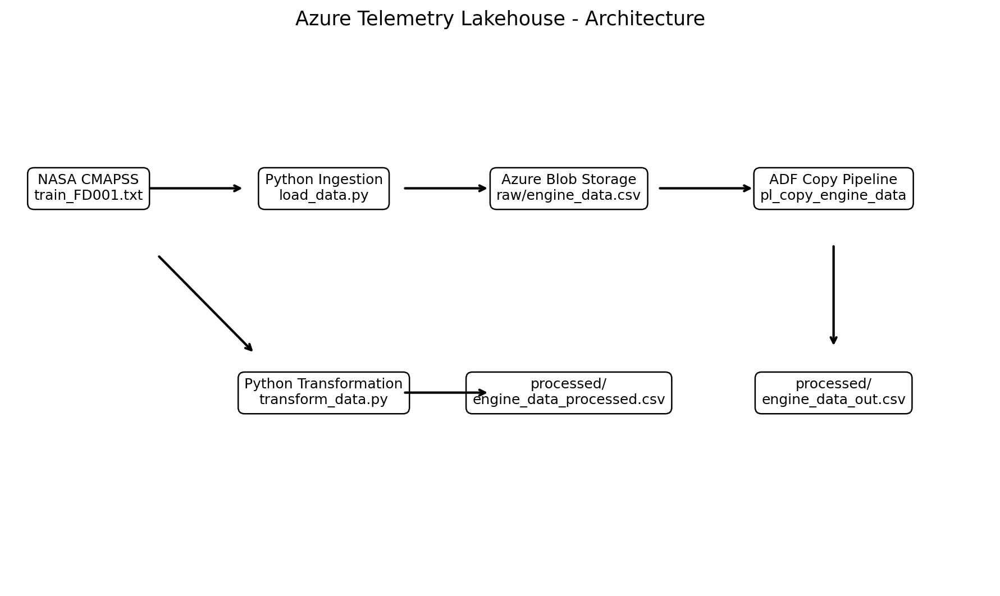

# Azure Telemetry Lakehouse

## Overview

This project simulates an avionics-style telemetry pipeline using public aircraft engine sensor data. I used Python to parse and transform raw telemetry-style records, Azure Blob Storage to organize raw and processed layers, and Azure Data Factory to orchestrate cloud-based data movement. The result is a structured dataset ready for health monitoring and predictive analytics.

The project uses publicly available NASA CMAPSS aircraft engine sensor data and combines:
- Azure Blob Storage for raw and processed layers
- Azure Data Factory for orchestration and copy pipelines
- Python for ingestion and transformation logic

## Architecture



## Use Case

In avionics and industrial platforms, telemetry data is generated continuously from sensors, control units, and monitored subsystems. Before it can be used for analysis or machine learning, the data usually needs to go through several stages:

- ingestion from source files or systems
- schema structuring
- storage in a raw data layer
- validation and transformation
- preparation for downstream analytics

This project simulates that flow using aircraft engine degradation data in a telemetry-style pipeline.

## Data Source

This project uses the NASA CMAPSS turbofan engine degradation simulation dataset.

Public source used for implementation:
- Kaggle: NASA Turbofan Engine Degradation Simulation

The repository does not include the raw data files in order to keep the project lightweight and avoid tracking local datasets in Git.

## Project Structure

```text
azure-telemetry-lakehouse/
├── data/
│   ├── raw/
│   └── processed/
├── docs/
├── notebooks/
├── screenshots/
│   └── architecture.png
├── src/
│   ├── ingestion/
│   │   └── load_data.py
│   ├── transformation/
│   │   └── transform_data.py
│   ├── quality/
│   └── utils/
├── .gitignore
├── README.md
└── requirements.txt
```

## Pipeline Flow

### 1. Raw source input
The original NASA dataset is provided as a whitespace-delimited text file such as:

```text
train_FD001.txt
```

### 2. Ingestion
A Python ingestion script reads the raw text file, assigns structured column names, and converts it into a clean CSV file:

```text
raw/engine_data.csv
```

### 3. Cloud raw layer
The structured raw CSV is uploaded into Azure Blob Storage under the `raw` container.

### 4. Azure orchestration
Azure Data Factory is used to build a copy pipeline that reads from the raw layer and writes an output file to the processed layer:

```text
processed/engine_data_out.csv
```

This file is mainly used to validate:
- Azure connectivity
- linked services
- datasets
- copy pipeline execution

### 5. Transformation
A separate Python transformation step creates the real processed telemetry dataset:

```text
processed/engine_data_processed.csv
```

This transformed file includes additional engineered features and is the actual processed analytics-ready output.

## Raw vs Processed Explanation

### Raw file
```text
raw/engine_data.csv
```
This is the structured version of the source data after parsing, but before feature engineering.

### ADF copy output
```text
processed/engine_data_out.csv
```
This is a copied version of the raw dataset created through Azure Data Factory. It proves the cloud pipeline works, but it is not the fully transformed output.

### Real processed output
```text
processed/engine_data_processed.csv
```
This is the real transformed dataset generated through Python logic and then uploaded to Azure.

## Transformation Logic

The transformation layer currently runs in Python to keep the solution cost-efficient and reproducible. It performs:

- duplicate removal
- null handling
- sorting by `unit_number` and `cycle`
- sensor delta calculations
- rolling average features
- health score approximation
- lifecycle progression ratio

### Example engineered features
- `sensor_2_delta`
- `sensor_3_delta`
- `sensor_4_delta`
- `sensor_2_roll3`
- `sensor_3_roll3`
- `health_score`
- `cycle_ratio`

## Why Transformation Was Kept Outside Azure

The current design intentionally keeps transformation outside cloud compute services in order to:

- avoid unnecessary Azure compute cost
- keep the project simple and controlled
- make development easy to reproduce locally
- focus first on storage, orchestration, and pipeline design

A future version can move selected transformations into:
- Azure Data Factory Data Flows
- Azure Databricks

## Azure Services Used

- Azure Blob Storage
- Azure Data Factory

## Skills Demonstrated

- data ingestion
- telemetry-style data modeling
- Azure storage layering
- Azure Data Factory pipeline creation
- Python-based transformation
- feature engineering
- Git/GitHub project organization

## How to Run Locally

Install dependencies:

```bash
pip install -r requirements.txt
```

Run ingestion:

```bash
python src/ingestion/load_data.py
```

Run transformation:

```bash
python src/transformation/transform_data.py
```


## Future Improvements

- add cloud-native data quality checks
- add Azure Data Factory Data Flows
- add SQL serving layer
- add monitoring and validation metrics
- add dashboard or analytics notebook

## Author

Ahmed Tantawy
